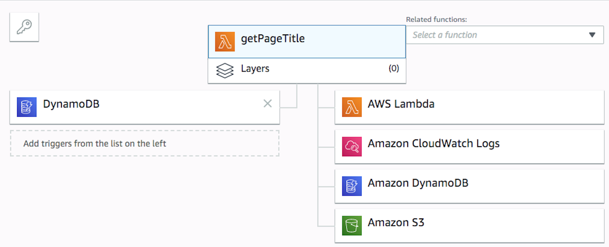

# serverless-getPage
**A simple serverless framework system used to retrieve minute details of a web page.**

# Reference:
https://serverless.com/framework/docs/providers/aws/guide/intro/




## Run locally?

download the zip file, unzip and change directory into document folder.

### Install serverless
```bash
npm install -g serverless
```

### setup AWS
*NB:* IAM AWS user should have programmatic access with policy to interact with lambda services
such as DynamoDB, S3, Lambda, Cloudformation, Cloudwatch and IAM amongst others depending on your use-case.
```bash
serverless config credentials --provider aws --key your_xxx_key --secret your_xxx_secret
```

## v4
Change directory to `document` & run  `npm install`
NB: You  should have docker running on your system before deploying, as this allows python packages to be added to the lambda function.


### deploy
```bash
serverless deploy
```

Once deployed go to your dynamodb service on us-east-1; under the `overview` tab for table `UrlDocument`
get the arn from the `Latest stream ARN` label

```
arn:aws:dynamodb:us-east-1:{your_account_id}:table/UrlDocument/stream/2019-06-07T14:34:54.231
```

update the serverless.yml config under
```functions.get_page_title_handler.events.stream ```

```yml
events:
      - stream: arn:aws:dynamodb:us-east-1:{your_account_id}:table/UrlDocument/stream/2019-06-07T14:34:54.231
```

### Redeploy:
### deploy
```bash
serverless deploy
```

Run this command locally to invoke the AWS lambda function
```bash
serverless invoke -f create_request_identifier_handler -s dev -r us-east-1 -l -p event.json
```

Verify by checking s3 and dynamoDB for the latest changes/updates.

### removal
```bash
serverless remove -v
```
